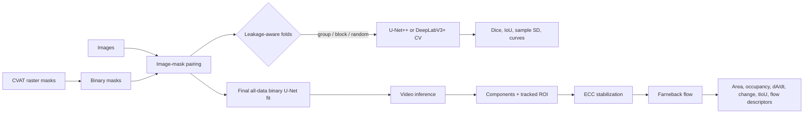

# Surgical Bleeding Segmentation & Temporal Analysis

A public, portfolio-oriented reconstruction of Klaudia Senator's research workflow for **binary bleeding segmentation in surgical video** and **temporal characterization of predicted blood regions**.

The repository complements [`perception-to-action`](https://github.com/klaudia-senator/perception-to-action) and [`teleoperation-control-and-compensation`](https://github.com/klaudia-senator/teleoperation-control-and-compensation) by showing the ML research lifecycle: annotation preprocessing, leakage-aware cross-validation, baseline training, evaluation, final-model fitting, video inference, motion compensation, and time-series descriptor extraction.

> **Data and safety notice**
>
> No patient data, internal surgical imagery, annotations, trained weights, private paths, robot interfaces, or clinical artifacts are distributed. This is research software and a portfolio demonstration, not a medical device or clinical decision-support system.

## Research workflow



Cross-validation is the **performance-estimation stage**. The final model is trained on all selected segmentation images only to produce masks for downstream temporal analysis. Its training-set fit metrics are labeled descriptive and must not be interpreted as independent generalization results.

## What is public and runnable

- CVAT raster-mask binarization with optional image-pair warnings
- stem-based image/mask pairing
- random K-fold, source-grouped K-fold, and contiguous block folds
- optional boundary-frame purging for block validation
- U-Net++ and DeepLabV3+ baselines from `segmentation_models_pytorch`
- shared BCE + Dice loss and Dice/IoU evaluation
- cross-validation summaries and learning-curve plots
- connected-component filtering and stateful ROI tracking
- ECC frame stabilization and Farneback optical flow
- temporal descriptors: blood area, ROI occupancy, `dA/dt`, frame-to-frame area change, temporal IoU, mean/p95 flow magnitude, and directional consistency
- a data-free synthetic descriptor smoke demo and focused unit tests

## Explicit research dependency

The uploaded research scripts import `src.models.unet.UNetBinary`, but that source file was not part of the supplied code. The accessible owned repositories were checked: they contain either a different `SegModel`, a multiclass public U-Net demo, or no implementation. This repository therefore **does not invent or silently replace Klaudia's model**.

The SMP cross-validation workflow is fully runnable. The final-model and video scripts intentionally stop with an explanatory error until the original owned implementation is supplied at `src/models/unet.py`, or another exact import is passed as:

```text
--model-import package.module:UNetBinary
```

Expected constructor compatibility, based on the original calling code:

```python
UNetBinary(base_ch=64, dropout=0.1, use_batchnorm=True, upsample_mode="transpose")
```

## Installation

Python 3.10+ is recommended.

```bash
python -m venv .venv
# Activate the environment for your platform, then:
python -m pip install -e ".[all]"
```

For the baseline training workflow only:

```bash
python -m pip install -e ".[baseline]"
```

## Safe, data-free demo

This demo creates synthetic masks in memory and exercises component filtering, ROI tracking, area/occupancy, frame-to-frame change, temporal IoU, and `dA/dt`:

```bash
python examples/synthetic_descriptor_demo.py
```

It writes `results/synthetic_demo/synthetic_temporal_metrics.csv`. The generated shapes are not clinical data and are not presented as model predictions.

## End-to-end usage

### 1. Binarize exported masks

```bash
python scripts/00_binarize_cvat_masks.py \
  --input-masks /path/to/cvat_masks \
  --output-masks data/example/binary_masks \
  --images-dir /path/to/images
```

Any non-zero raster value is treated as foreground, matching the supplied research code. Confirm that this is appropriate for your CVAT export before training.

### 2. Create cross-validation folds

For frames extracted from videos or repeated acquisitions, source-grouped CV is the safest default:

```bash
python scripts/02_make_cv_folds.py \
  --dataset-name public_example \
  --images-dir /path/to/images_by_video \
  --masks-dir /path/to/binary_masks_by_video \
  --recursive \
  --split-mode group \
  --group-from parent \
  --n-splits 5
```

Grouping keeps every source/video directory in only one side of each split and the script checks for overlap. `stem_prefix` is useful only when the filename prefix truly identifies the acquisition source.

Block CV holds out contiguous portions of one ordered sequence:

```bash
python scripts/02_make_cv_folds.py \
  --dataset-name public_sequence \
  --images-dir /path/to/ordered_frames \
  --masks-dir /path/to/ordered_masks \
  --split-mode block \
  --purge-frames 10
```

Use block mode to study temporal extrapolation within a sequence. Neighbor purging reduces boundary leakage, but frames from the same source still occur in train and validation. For an independent-source estimate, use `group` mode. Random K-fold should be restricted to independently sampled images; it can severely overestimate performance on adjacent video frames.

### 3. Cross-validate SMP baselines

```bash
python scripts/03b_cross_validate_smp_baseline.py \
  --model unetplusplus \
  --encoder resnet34 \
  --folds-dir data/manifests/public_example_5fold \
  --out-dir results/cv_unetplusplus \
  --epochs 30 --amp
```

Replace `unetplusplus` with `deeplabv3plus` for the second supplied baseline. Encoder weights default to `None`, so no pretrained weights are downloaded implicitly.

### 4. Summarize CV

```bash
python scripts/04_summarize_and_plot_cv.py --results-dir results/cv_unetplusplus
```

Fold dispersion is reported consistently as **sample standard deviation (`ddof=1`)**. A single-fold run reports SD `0.0`.

### 5. Fit the final descriptor model

After adding the verified owned `UNetBinary` implementation:

```bash
python scripts/03c_train_final_unet_for_descriptors.py \
  --pairs-csv data/manifests/public_example_5fold/all_pairs.csv \
  --out-dir results/final_unet \
  --epochs 30 --amp
```

This deliberately uses all selected pairs. The generated summary explicitly labels its Dice/IoU as descriptive training-set fit metrics.

### 6. Extract temporal descriptors

```bash
python scripts/06_collect_temporal_metrics_unetbinary.py \
  --model-path results/final_unet/final_model.pt \
  --video-path /path/to/public_or_synthetic_video.mp4 \
  --case-id public_demo_01 \
  --domain public-demo \
  --out-root results/temporal_descriptors
```

For multiple videos, copy `configs/temporal_manifest.example.csv`, use only public or authorized inputs, and pass `--manifest`.

## Reproducibility

Every training run records its configuration and core library versions. `--seed` initializes Python, NumPy, CPU PyTorch, and CUDA RNGs.

- default mode enables cuDNN benchmarking for throughput; exact repeatability is not claimed;
- `--deterministic` disables benchmarking, enables deterministic cuDNN behavior, and asks PyTorch to prefer deterministic algorithms (with warnings where unavailable);
- hardware, driver, library, and nondeterministic operator differences can still affect results.

## Project structure

```text
src/surgical_bleeding/
  data.py              pairing and reusable dataset
  losses.py            BCE + Dice objective
  metrics.py           Dice, IoU, consistent CV statistics
  models.py            SMP factory and verified-model loader
  reproducibility.py   seeding and run metadata
  splits.py            random/group/block split logic
  temporal.py          masks, ROI tracking, ECC, flow, descriptors
  training.py          shared training/evaluation utilities
scripts/               numbered research workflow entry points
examples/              synthetic, data-free smoke demo
configs/               public-safe manifest example
tests/                 metrics, leakage, ROI, and descriptor tests
```

## Methodology provenance

The workflow is a cleaned public implementation derived from the supplied research scripts. It is not a claim that the private experimental dataset, exact checkpoint, or complete internal research environment has been released. Parameter defaults preserve the demonstrated pipeline where possible, while hard-coded internal paths and duplicated code have been removed.

The associated 2026 paper is:

> K. Senator, D. Krawczyk, and Z. Nawrat, “Deep Learning-Based Blood Segmentation and Temporal Characterization for the Robin Heart Surgical Robot,” *Surgeries*, 2026. [https://doi.org/10.3390/surgeries7020070](https://doi.org/10.3390/surgeries7020070)

Please cite the paper for the research methodology. Repository code and paper content are distinct artifacts.

## Tests

```bash
pytest
```

The tests use synthetic arrays only. They cover metric edge cases, sample-SD reporting, source-group leakage checks, block purging, component filtering, ROI expiry, temporal IoU, and flow direction consistency.

## Licensing and data rights

No software license is asserted here because the ownership and release terms of the research-derived code should be confirmed before publication. No rights to private datasets, images, annotations, checkpoints, or third-party clinical material are granted.

